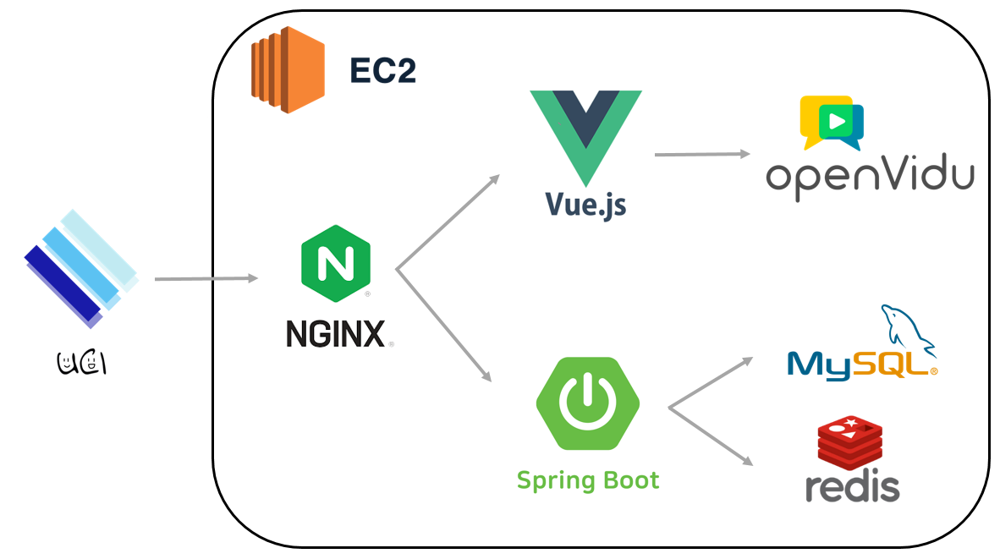

# 😋**UCI (얼굴보고 친해지자 아이스브레이킹)**

## **👇UCI 소개 및 시연 영상👇**

=======
%20d0c797bba6af4fe48dc8f5506790572f/Untitled.png)

아래는 예시 수정 예정
UCI 시연 시나리오는 👉[여기](시연시나리오.md)👈에서 더 자세히 보실 수 있습니다.

# ****Ⅰ****. **서비스 소개**

---

## **✨서비스 설명**

---

//개발배경 및 서두

### 개요

### 타겟

### **프로젝트 기간 - 2022.07.05 ~ 2022.08.19**

## **✨UCI의 모토**

`얼굴 보고 친해지자 아이스브레이킹!`

## **✨기획 배경**

---

### 배경

### 목적

### 의의

## ⚡**UCI 서비스 화면**

---

### **회원가입**

회원가입 GIF 추가

### 로그인

로그인 GIF 추가

### **마이페이지 - 프로필 변경**

프로필 변경 GIF 추가

### 방 **- 생성 참여**

방 생성 참여 GIF 추가

### 방 **- 채팅**

방 채팅화면 GIF 추가

### **게임 - 동상이몽**

동상이몽 게임진행화면 GIF 추가

### **게임 - 동상이몽 투표 진행**

동상이몽 투표진행 GIF 추가

### **게임이 끝났을 때 - 벌칙 수행**

게임 끝났을 때 벌칙 수행 GIF 추가

## **✨ 주요 기능**

---

- 서비스 설명 : 아이스브레이킹
- 주요 기능 :
    - webRTC를 통한 아이스브레이킹용 실시간 화상 채팅 게임
    - 투표 결과에 따른 벌칙을 통한 웃음 유도

# ****Ⅱ. 기술스택****

---

## **🖥️ 개발 환경**

---

🖱**Backend**

- IntelliJ
- spring boot 2.7.2
- spring-boot-jpa
- Spring Security
- Java 8
- AWS EC2
- mysql
- redis

🖱**Frontend**

- Visual Studio Code
- Node.js 16.16.0
- Vue.js 2

🖱**Web RTC**

- OpenVidu CE 2.22.0

## **💫 서비스 아키텍처**

---

## **✨WebRTC**

---

> WebRTC (Web Real-Time Communication)는 웹 브라우저 간에 플러그인의 도움 없이 서로 통신할 수 있도록 설계된 API이다.
> 
> 
> W3C에서 제시된 초안이며, 음성 통화, 영상 통화, P2P 파일 공유 등으로 활용될 수 있다.
> 

## **✨openVidu[🔗](https://openvidu.io/)**

---

> OpenVidu is a platform to facilitate the addition of video calls in your web or mobile application. It provides a complete stack of technologies very easy to integrate in your application. Our main goal is to allow developers to add real-time communications to their apps very fast and with low impact in their code.
> 

WebRTC를 보다 간단하게 적용할 수 있고, 다양한 프레임워크와 호환성이 높다는  장점이 있는 openvidu를 사용하여 프로젝트를 진행했습니다. 

## **✨Web Socket**

---

%20d0c797bba6af4fe48dc8f5506790572f/img1.daumcdn.png)

> 웹소켓(WebSocket)은 하나의 TCP 접속에 전이중 통신 채널을 제공하는 컴퓨터 통신 프로토콜이다. 웹소켓 프로토콜은 2011년 IETF에 의해 RFC 6455로 표준화되었으며 웹 IDL의 웹소켓 API는 W3C에 의해 표준화되고 있다. (이미지 출처 : [https://kku-jun.tistory.com/17](https://kku-jun.tistory.com/17))
> 

일반적인 `Ajax`
 통신의 `Poling`방식과 다르게, 특정 `end point`(종단점)를 구독하면 종단지점과 연결된 모든 통신을 수신할 수 있으며, 실시간 양방향 소통이 가능합니다. 그래서 실시간 채팅등에 많이 활용되고 있습니다. 저희 또한 채팅 기능 등을 구현함에 있어서 웹소켓을 사용하였습니다.

### **SockJS [🔗](https://github.com/sockjs/sockjs-client)**

> SockJS는 WebSocket과 유사한 객체를 제공하는 브라우저 JavaScript 라이브러리입니다. SockJS는 브라우저와 웹 서버 사이에 짧은 대기 시간, 전이중, 도메인 간 통신 채널을 생성하는 일관된 브라우저 간 Javascript API를 제공합니다.
> 

소켓 통신을 이용하기 위해 사용하는 첫 번째 라이브러리입니다. `SockJS`로 통신에 필요한 `end point` (종단점)로 `socket` 객체를 생성합니다.

### **Stomp.js [🔗](https://github.com/stomp-js/stompjs)**

> 이 라이브러리를 사용하면 WebSocket을 통해 STOMP 브로커에 연결할 수 있습니다. 이 라이브러리는 모든 현재 프로토콜 변형을 포함하여 완전한 STOMP 사양을 지원합니다. 가장 인기 있는 메시징 브로커는 기본적으로 또는 플러그인을 사용하여 WebSocket을 통해 STOMP 및 STOMP를 지원합니다.
> 

소켓 통신을 이용하기 위해서 사용하는 두 번째 라이브러리입니다. `Stomp.js`로 생성된 `socket` 객체로부터 `stompClient`를 생성하고, 연결 및 구독, 전송합니다. FrontEnd에서 소켓을 통해 전송된 내용이 BackEnd에서 동일한 endpoint로 일괄적으로 수신되며, BackEnd에서 이를 다시 FrontEnd로 전달합니다. 채팅 소켓의 경우 추가적인 처리 없이 받은 내용을 그대로 모든 구독자에게 반환합니다. 

## **✨Redis**

---

 저희는 Spring Scurity와 JWT를 이용하여 로그인 등의 사용자 인증을 구현하였습니다.  Redis를 이용해 로그아웃시킨 사용자의 토큰들을 만료처리하여 해당 토큰으로는 다시 인증할 수 없도록 구현하였습니다.

## **✨배포**

---

Nginx를 웹서버로 하여 수동배포 하였습니다.

자세한 사항은 다음을 참고해주세요.

[빌드 및 배포 가이드](exec/빌드배포가이드.md)

## **👨‍👩‍👧협업 툴**

---

- Git
- Jira
- Notion
- Mattermost
- Webex
- Figma
- ERD cloud

# ****Ⅲ. 프로젝트 진행****

---

 저희 프로젝트는 `Agile`방식으로 개발을 진행하였고, 매주 월요일 스크럼 회의를 통해 Jira를 사용한 스프린트 일정관리를 하였습니다. 

## **🎨 화면 설계서**

---

아래는 예시 uci 화면설계서로 대체 예정

### **✨코드 컨벤션**

---

[Front](기획/프론트컨벤션/README.md)

[Back](기획/백컨벤션/README.md)

### **✨Git 컨벤션**

### **👨‍👩‍👧 Jira**

---

협업 및 일정, 업무 관리를 위해 Jira를 이용하였습니다. 매주 월요일 오전 스크럼 회의에서 한 주동안 진행되어야 할 1주 단위 계획을 짜고, 진행할 이슈들을 스프린트를 만들어 등록했습니다. 스토리 포인트 1점당 1시간 단위의 작업량으로서 선정하였고, 스프린트는 일주일 단위로 진행하였습니다.

- Epic :
- story :

이 외에, 협업 메신저(Mattermost)에 알람을 등록하여 작업 상황을 실시간으로 확인할 수 있도록 했습니다.

### **👨‍👩‍👧 Notion**

---

모두가 봐야할 공지, 함께 선정해야하는 주제 및 초기 ERD, API 설계, 공부해야 할 링크, 트러블 슈팅 등을 모아서 관리했습니다. 컨벤션 규칙 등도 노션에 기록하여 모두가 항시 확인할 수 있도록 관리했습니다.

//노션 링크 추가 바람

### **✨ ER Diagram**

---

=======
%20d0c797bba6af4fe48dc8f5506790572f/ERD.png)
### **✨ EC2 포트 정리**

---

[포트](https://www.notion.so/dd6e41f1de42402c9d927db5f6817b9e)

### **😃 팀원 역할**

---

아래는 예시 수정바람

- **팀원1**
    - openvidu를 통한 WebRTC 기능 구현
    - 백엔드 방 관리 API 구현(방 만들기/빠른 시작/방 찾기/방 나가기/방장 부여)
    - 백엔드 관리자 API 구현
    - 오픈비두 서버 배포
    - styled-component와 material-ui를 통한 css 스타일링
- **팀원2**
    - react와 redux-toolkit을 활용하여 SPA 구현
    - 프론트 개발(회원가입, 로그인, 회원정보 수정, 메인 화면, 랭킹, 튜토리얼, 마이페이지, 방만들기, 방찾기등, 관리자 페이지 구현)
    - styled-components와 material-ui를 통한 컴포넌트 레이아웃 구현 및 css 스타일링
- **팀원3**
    - Teachable Machine을 통한 운동 인식 구현
    - 운동별 로직을 통한 운동 카운트 기능 및 튜토리얼 구현
    - Openvidu를 통한 게임 내부 정보 실시간 통신
    - 게임 시작, 종료 이벤트 처리 및 실시간 랭킹, 채팅 기능 구현
    - styled-component와 material-ui를 통한 css 스타일링
- **팀장(본인)**
    - Spring security, JWT, JPA를 이용한 이메일 인증(폼 구현)회원가입, 로그인 기능 구현 (인증, 인가)
    - JWT, Redis 캐싱을 이용한 랭킹 조회 정보 캐싱 처리 구현
    - JWT, Redis를 이용해 로그아웃된 토큰 재사용 불가 처리 구현
    - 비밀번호 변경, 닉네임 변경, 회원 정보 CRUD 구현
    - 연속 운동일 수 조회, 1일 1홈동 조회, 방장 게임 시작 기능, 게임 끝 기능, 렝킹 페이지 기능, 최고 기록 조회, 뱃지 조회 등의 Spring Boot 백엔드 기능 구현
    - Jenkins, Docker를 이용한 CD 구현 - Docker로 nginx+react container, spring boot container 생성하여 배포
    - Nginx 리다이렉트 설정 및 백엔드 및 프론트엔드 url 분기 처리 (/, /api/**)
    - react를 이용한 프론트엔드 프로필 설정 및 프로필 변경 기능, 프로필 변경 및 1일 1홈동 호버 툴팁 구현
    - 게임 및 채팅 기능 javascript → react로 migration
    - styled-component를 통한 css 스타일링

### **⁉UCI의 개발 과정이 궁금하다면?!**

---

//추후 추가 예정

👉UCI 기술 블로그 보러가기 👈

### **🐣UCI을 개발하고 난 후의 회고**

---

//추후 추가 예정
