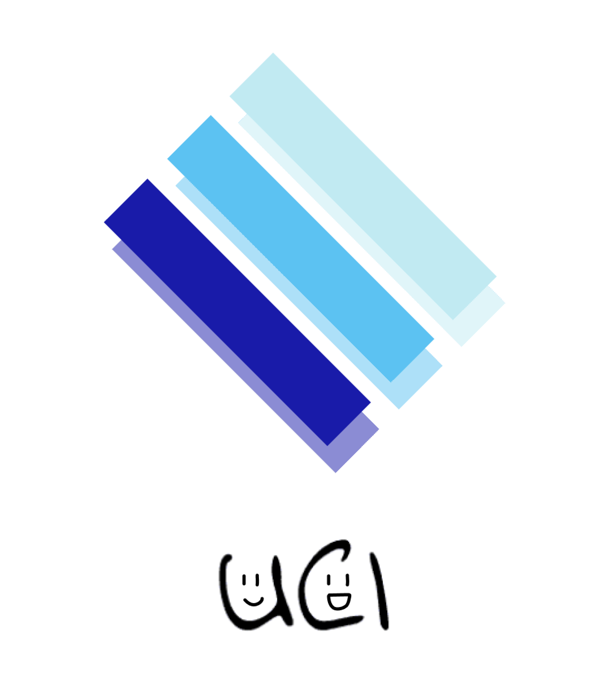
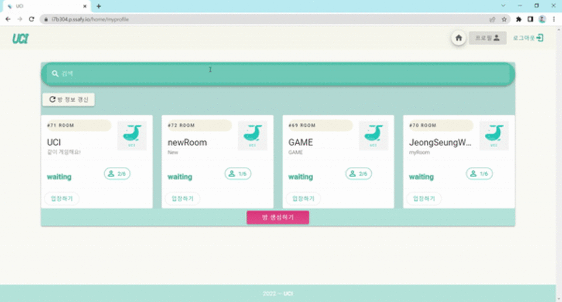
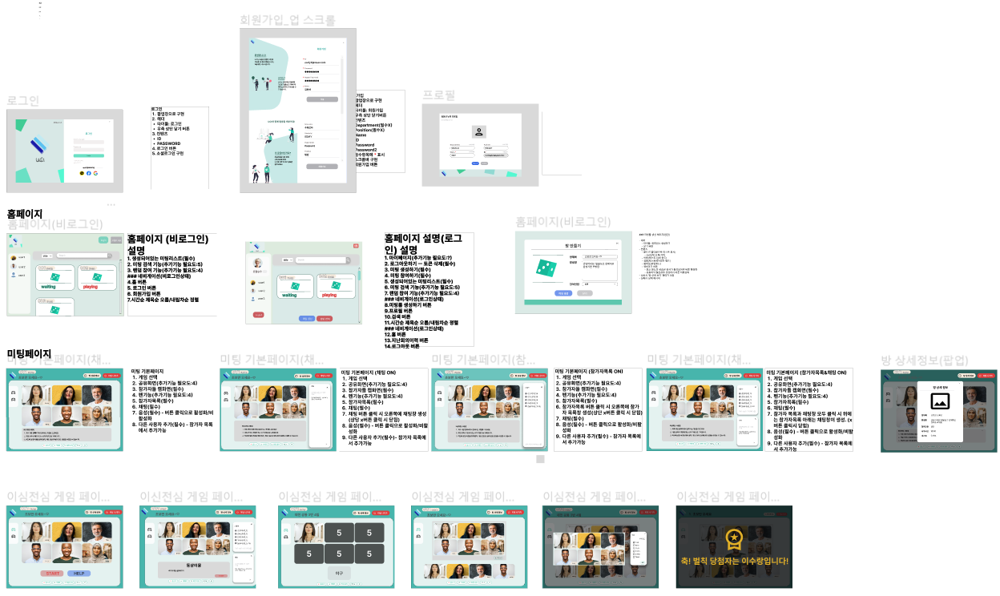
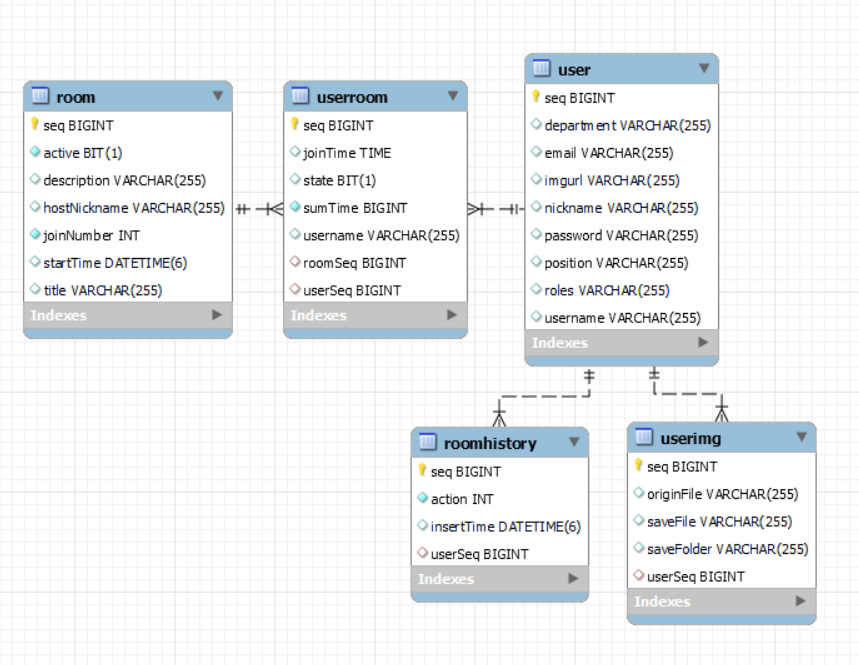

# 😋**UCI (얼굴보고 친해지자 아이스브레이킹)**

## **👇UCI 소개👇**

UCI 시연 시나리오는 👉[여기](https://github.com/yesfordev/homedong/blob/develop/%EC%8B%9C%EC%97%B0%20%EC%8B%9C%EB%82%98%EB%A6%AC%EC%98%A4.md)👈에서 더 자세히 보실 수 있습니다.

# ****Ⅰ****. **서비스 소개**

---

## **✨서비스 설명**

---

### 개요

- 한줄 소개 : 초대면에서의 분위기 환기를 위한  `웹 화상 게임` 서비스
- 서비스 명 : **UCI(얼굴보고 친해지자 아이스브레이킹)**

### 타겟

- 새학기를 맞이한 학생들
- 팀프로젝트, 단체생활을 시작하게 된 사람들
- 신입 OT에 참여한 신입 직장인

### **프로젝트 기간 - 2022.07.05 ~ 2022.08.19**

## **✨UCI의 모토**

`얼굴 보고 친해지자 아이스브레이킹!`

## **✨기획 배경**

---

### 배경

- 코로나 19 이후 급격하게 확산된 언택트 문화. 이로 인해 대면으로 사람을 만나기보다 온라인 플랫폼을 통한 비대면으로 사람을 만나는 경우가 매우 많아짐.
    - 이를 증명하듯, 많은 기업들이 신입사원 교육, 연수 등을 메타버스와 같은 가상 플랫폼에서 진행하는 경우가 많음
- 이러한 상황으로 인해 첫만남의 어색함을 풀기가 더더욱 어려워졌고, 이로 인해 오는 스트레스는 증가하는 반면, 각 집단에서의 업무 효율 등이 매우 낮아짐
- 화상회의 시스템에서 처음 만났을 때의 어색함을 풀 수 있는 좋은 방법이 없을까 고민하던 중 화상회의를 활용한 게임 서비스를 개발하기로 함

### 목적

- 첫 만남에서 어색함을 쉽게 풀어줄, 즉, 아이스 브레이킹을 더 쉽게 할 수 있는 서비스 제공

### 의의

- 온라인 공간에서도 조직원 간의 친밀도를 쉽게 향상 시킬 수 있음
- 친밀도 및 유대감의 증가는 자연스럽게 업무 효율 증가로 이어질 것이라 예측

## ⚡**UCI 서비스 화면**

---

### **회원가입**

### 로그인

### 프로필 수정

### 방 검색

### 방 **- 생성 참여**

### 방 **- 채팅**

### **게임 진행 화면- 동상이몽**

## **✨ 주요 기능**

---

- 서비스 설명 : 아이스브레이킹
- 주요 기능 :
    - webRTC를 통한 아이스브레이킹용 실시간 화상 채팅 게임
    - 투표 결과에 따른 벌칙을 통한 웃음 유도

# ****Ⅱ. 기술스택****

---

## **🖥️ 개발 환경**

---

🖱**Backend**

- IntelliJ
- spring boot 2.7.2
- Java 8
- AWS EC2
- mysql 8.0.29
- redis 5.0.7

🖱**Frontend**

- Visual Studio Code
- Node.js 16.16.0
- Vue.js 2.0

🖱**Web RTC**

- OpenVidu CE 2.22.0

## **💫 서비스 아키텍처**

---

## **✨WebRTC**

---

!https://github.com/parkjisu6239/2021_Narang/raw/master/README.assets/image-20210828151835934.png

!https://github.com/parkjisu6239/2021_Narang/raw/master/README.assets/image-20210828152033949.png

> WebRTC (Web Real-Time Communication)는 웹 브라우저 간에 플러그인의 도움 없이 서로 통신할 수 있도록 설계된 API이다.
> 
> 
> W3C에서 제시된 초안이며, 음성 통화, 영상 통화, P2P 파일 공유 등으로 활용될 수 있다.
> 

## **✨openVidu[🔗](https://openvidu.io/)**

---

!https://github.com/parkjisu6239/2021_Narang/raw/master/README.assets/image-20210828152009951.png

> OpenVidu is a platform to facilitate the addition of video calls in your web or mobile application. It provides a complete stack of technologies very easy to integrate in your application. Our main goal is to allow developers to add real-time communications to their apps very fast and with low impact in their code.
> 

WebRTC를 보다 간단하게 적용할 수 있고, 다양한 프레임워크와 호환성이 높다는  장점이 있는 openvidu를 사용하여 프로젝트를 진행했습니다. 

## **✨Web Socket**

---

> 웹소켓(WebSocket)은 하나의 TCP 접속에 전이중 통신 채널을 제공하는 컴퓨터 통신 프로토콜이다. 웹소켓 프로토콜은 2011년 IETF에 의해 RFC 6455로 표준화되었으며 웹 IDL의 웹소켓 API는 W3C에 의해 표준화되고 있다. (이미지 출처 : https://kku-jun.tistory.com/17)
> 

일반적인 `Ajax`
 통신의 `Poling`방식과 다르게, 특정 `end point`(종단점)를 구독하면 종단지점과 연결된 모든 통신을 수신할 수 있으며, 실시간 양방향 소통이 가능합니다. 그래서 실시간 채팅등에 많이 활용되고 있습니다. 저희 또한 채팅 기능 등을 구현함에 있어서 웹소켓을 사용하였습니다.

### **SockJS [🔗](https://github.com/sockjs/sockjs-client)**

> SockJS는 WebSocket과 유사한 객체를 제공하는 브라우저 JavaScript 라이브러리입니다. SockJS는 브라우저와 웹 서버 사이에 짧은 대기 시간, 전이중, 도메인 간 통신 채널을 생성하는 일관된 브라우저 간 Javascript API를 제공합니다.
> 

소켓 통신을 이용하기 위해 사용하는 첫 번째 라이브러리입니다. `SockJS`로 통신에 필요한 `end point` (종단점)로 `socket` 객체를 생성합니다.

### **Stomp.js [🔗](https://github.com/stomp-js/stompjs)**

> 이 라이브러리를 사용하면 WebSocket을 통해 STOMP 브로커에 연결할 수 있습니다. 이 라이브러리는 모든 현재 프로토콜 변형을 포함하여 완전한 STOMP 사양을 지원합니다. 가장 인기 있는 메시징 브로커는 기본적으로 또는 플러그인을 사용하여 WebSocket을 통해 STOMP 및 STOMP를 지원합니다.
> 

소켓 통신을 이용하기 위해서 사용하는 두 번째 라이브러리입니다. `Stomp.js`로 생성된 `socket` 객체로부터 `stompClient`를 생성하고, 연결 및 구독, 전송합니다. FrontEnd에서 소켓을 통해 전송된 내용이 BackEnd에서 동일한 endpoint로 일괄적으로 수신되며, BackEnd에서 이를 다시 FrontEnd로 전달합니다. 채팅 소켓의 경우 추가적인 처리 없이 받은 내용을 그대로 모든 구독자에게 반환합니다. 

## **✨Redis**

---

 저희는 Spring Scurity와 JWT를 이용하여 로그인 등의 사용자 인증을 구현하였습니다.  Redis에 로그아웃한 사용자의 토큰을 저장하여 로그아웃시킨 사용자의 토큰들을 만료처리하여 해당 토큰으로는 다시 인증할 수 없도록 구현하였습니다.

프론트에서만 토큰을 지워줬을 경우 만약 토큰이 지워지기전에 탈취를 당했을 경우, 해당 토큰으로 접근이 가능하기 때문에 Redis를 사용하였습니다.

## **✨배포**

---

Nginx를 웹서버로 하여 수동배포 하였습니다.

자세한 사항은 다음을 참고해주세요.

[빌드 및 배포 가이드](https://www.notion.so/c757d829b4164e4e9bb9d5df16166602?pvs=21)

## **👨‍👩‍👧협업 툴**

---

- Git
- Jira
- Notion
- Mattermost
- Webex
- Figma
- ERD cloud

# ****Ⅲ. 프로젝트 진행****

---

 저희 프로젝트는 `Agile`방식으로 개발을 진행하였고, 매주 월요일 스크럼 회의를 통해 Jira를 사용한 스프린트 일정관리를 하였습니다. 

## **💭요구사항 정의서**

---

추가 할 지 미정

## **🎨 화면 설계서**

---

### **✨코드 컨벤션**

---

자세한 사항은 다음을 참고해 주세요.

[Front-end 코드 컨벤션](https://www.notion.so/1cf2e89c926d48fc8f21b29033d0dff1?pvs=21)

[Back-end 코드 컨벤션](https://www.notion.so/e514a998285d4b8cbcda8056a50e7e61?pvs=21)

### **✨Git 컨벤션**

---

자세한 사항은 다음을 참고해 주세요.

 [Git 컨벤션](https://www.notion.so/Git-697a878d609f40949a56edb71bbbd3fb?pvs=21)

### **👨‍👩‍👧 Jira**

---

협업 및 일정, 업무 관리를 위해 Jira를 이용하였습니다. 매주 월요일 오전 스크럼 회의에서 한 주동안 진행되어야 할 1주 단위 계획을 짜고, 진행할 이슈들을 스프린트를 만들어 등록했습니다. 스토리 포인트 1점당 1시간 단위의 작업량으로서 선정하였고, 스프린트는 일주일 단위로 진행하였습니다.

- Epic : 프론트, 백, 공통기능, 문서작업 등 태그를 통해 대분류, 그리고 제목을 통해 중분류로 구성하였습니다.
- story : Epic에 해당하는 업무 중 가장 작은 업무 단위를 뜻합니다.

이 외에, 협업 메신저(Mattermost)에 알람을 등록하여 작업 상황을 실시간으로 확인할 수 있도록 했습니다.

컨벤션에 관한 내용은 다음을 참고해 주세요.

[Jira 컨벤션](https://www.notion.so/JIRA-2fd16a2267194fa3af1a817e559e7bf3?pvs=21)

### **👨‍👩‍👧 Notion**

---

모두가 봐야할 공지, 함께 선정해야하는 주제 및 초기 ERD, API 설계, 공부해야 할 링크, 트러블 슈팅 등을 모아서 관리했습니다. 컨벤션 규칙 등도 노션에 기록하여 모두가 항시 확인할 수 있도록 관리했습니다.

[[노션 바로가기]](https://www.notion.so/e6a2e646e0a6448684cbe7ca1135e8d2?pvs=21)

### **✨ ER Diagram**

---

### **✨ EC2 포트 정리**

---

[포트](https://www.notion.so/dd6e41f1de42402c9d927db5f6817b9e?pvs=21)

### **😃 팀원 역할**

---

- **김선후(팀장, BE)**
    - WebSocket 컨트롤러 및 핸들러 구현 with sockJS(채팅 기능 등)
    - 백엔드 Room API 구현(방 생성/방 검색/방 삭제/게임시작/게임종료)
    - 백엔드 UserRoom API 구현(방 입장/방 나가기)
    - DB 설계 및 구축
    - Swagger config 구현
- **김동신(FE)**
    - react와 redux-toolkit을 활용하여 SPA 구현
    - 프론트 개발(회원가입, 로그인, 회원정보 수정, 메인 화면, 랭킹, 튜토리얼, 마이페이지, 방만들기, 방찾기등, 관리자 페이지 구현)
    - styled-components와 material-ui를 통한 컴포넌트 레이아웃 구현 및 css 스타일링
- **김호진(FE)**
    - Teachable Machine을 통한 운동 인식 구현
    - 운동별 로직을 통한 운동 카운트 기능 및 튜토리얼 구현
    - Openvidu를 통한 게임 내부 정보 실시간 통신
    - 게임 시작, 종료 이벤트 처리 및 실시간 랭킹, 채팅 기능 구현
    - styled-component와 material-ui를 통한 css 스타일링
- **이수랑(FE, 서버)**
    - Vue를 이용한 검색 필터 구현
    - AWS EC2 를 활용한 수동 배포 작업
    - Nginx 웹서버를 활용하여 서버 요청에 대한 프록시 매핑
- **정승우(BE)**
    - Spring security, JWT, JPA를 이용한 이메일 인증(폼 구현)회원가입, 로그인 기능 구현 (인증, 인가)
    - JWT, Redis 를 활용한 로그아웃 기능 구현(Redis 서버에 로그아웃 사용자 토큰 저장)
    - JWT, Redis를 이용해 로그아웃된 토큰 재사용 불가 처리 구현
    - User 관련 구현(회원가입, 로그인, 로그아웃, 프로필 조회, 프로필 정보 수정, 프로필 이미지 업로드, 프로필 이미지 조회, 유저에 대한 회의 이력 조회)
    

### **⁉UCI의 개발 과정이 궁금하다면?!**

---

//추후 추가 예정

👉UCI 기술 블로그 보러가기 👈

### **🐣UCI을 개발하고 난 후의 회고**

---

- 개발 작업량 분배에 있어서 시간 관념을 철저하게 기획하자.
- 트러블 슈팅은 제때제때 해놓자.
- 기획은 가장 중요하나 너무 개발 시간을 빼앗지는 말자
- 문서화를 잘 하자!