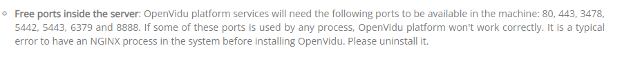
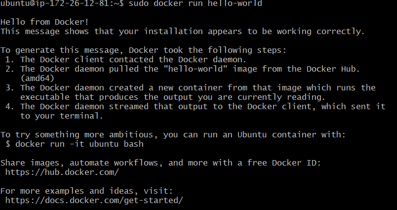
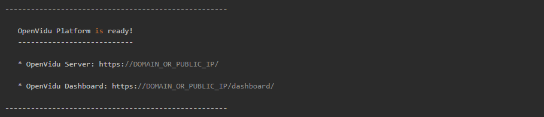
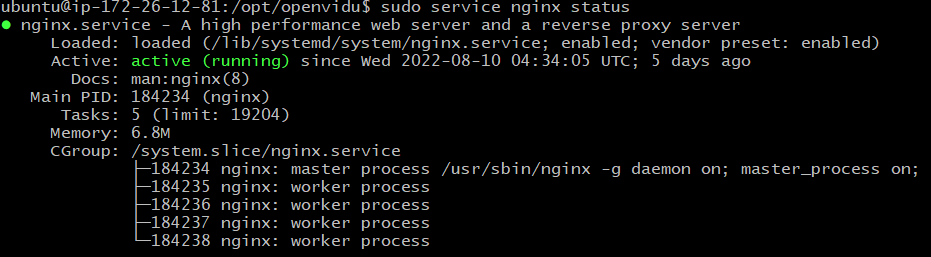
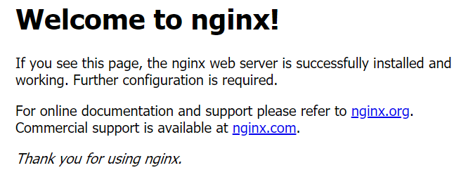
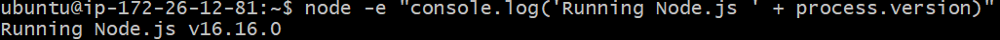
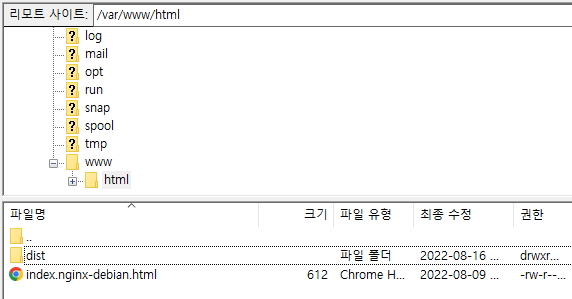
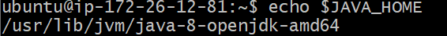
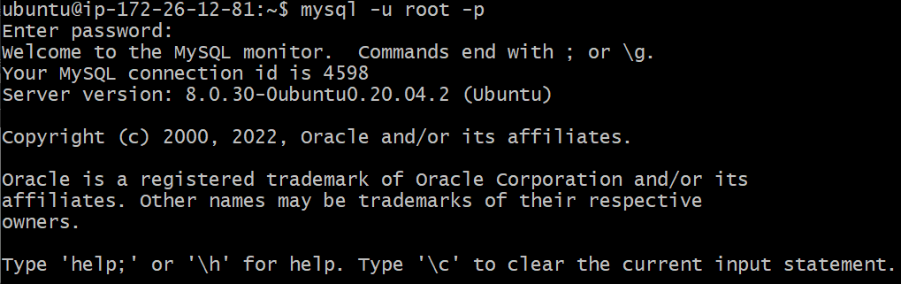
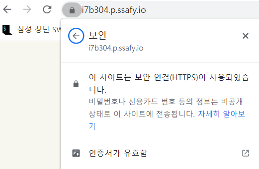

# 빌드 및 배포 가이드

[toc]


# 버전

## Back-end

[JDK 1.8.0_341](https://www.oracle.com/java/technologies/downloads/)

[MySQL 8.0.29](https://downloads.mysql.com/archives/installer/)

[Redis 3.0.504](https://github.com/microsoftarchive/redis/releases)

springboot 2.7.2

## Front-end

[Node.js 16.16.0](https://nodejs.org/ko/)

vue 2.0

## WebRTC

[OpenVidu CE 2.22.0](https://docs.openvidu.io/en/2.22.0/deployment/ce/on-premises/)

# 빌드 및 배포

\*주의사항*

**OpenVidu**에  자체적으로 사용하는 **Nginx**가 내장되어 있기 때문에, 우리가 사용하려는 **Nginx**와 충돌한다. 제대로 설치가 되지않거나, **OpenVidu**와 **Nginx**를 동시에 실행시킬 수 없는 문제가 발생함.

두 프로그램이 default값으로 사용하는 포트번호가 겹치는 것이 원인으로 보이며 해결방법은 

1. OpenVidu를 **가장 먼저** 배포하고 나머지 배포를 진행한다.
2. 겹치는 **포트번호를 변경**해준다. 

1번 방법으로 해결이 안되면 2번 방법을 시도할 것. 이 문서에서는 2번 방법까지 모두 사용함(Nginx를 주 웹서버로 활용할 것이기 때문에 OpenVidu의 포트번호를 변경해 주었음. OpenVIdu 환경변수 설정하는 항목에서 같이 다룰 예정)   

또한 Openvidu에서 사용하는 고정된 포트번호를 다음과 같이 제시하고 있으니 해당 포트번호를 사용하지 않도록 유의할 것.



## 1. OpenVidu

OpenVidu 공식문서에서 제공하는 On premises 방식으로 배포한다.

해당 방식은 **Docker**를 이용하므로 **Docker**를 우선 설치해준다.

### Docker install

먼저 EC2에 연결한 후

- 패키지리스트를 업데이트하고 repository 관련 패키지 설치

```bash
$ sudo apt-get update
$ sudo apt-get install \
   ca-certificates \
   curl \
   gnupg \
   lsb-release
```

- 공식 key 추가

```bash
$ sudo mkdir -p /etc/apt/keyrings
$ curl -fsSL https://download.docker.com/linux/ubuntu/gpg | sudo gpg --dearmor -o /etc/apt/keyrings/docker.gpg
```

- repository 세팅

```bash
$ echo \
  "deb [arch=$(dpkg --print-architecture) signed-by=/etc/apt/keyrings/docker.gpg] https://download.docker.com/linux/ubuntu \
  $(lsb_release -cs) stable" | sudo tee /etc/apt/sources.list.d/docker.list > /dev/null
```

- 패키지리스트 업데이트 후 도커 설치

```bash
$ sudo apt-get update
$ sudo apt-get install docker-ce
```

- 설치확인

```bash
$ sudo docker run hello-world
```




---

### OpenVidu install

- 관리자 유저로 변경(sudo로 처리해야할 작업이 많음)

```bash
$ sudo su
```

- 설치할 경로로 이동

```bash
$ cd /opt
```

- OpenVidu 설치

```bash
$ curl <https://s3-eu-west-1.amazonaws.com/aws.openvidu.io/install_openvidu_latest.sh> | bash
```

- 설치된 폴더로 이동하여 환경변수 설정
  - DOMAIN_OR_PUBLIC_IP: 사용할 도메인 주소
  - OPENVIDU_SECRET: 프로젝트에서 사용할 시크릿키(OpenVidu API 호출하는 코드 작성시 일치시켜 주어야함)
  - CERTIFICATE_TYPE: 사용할 증명서(selfsigned / owncert / **letsencrypt**)
  - LETSENCRYPT_EMAIL: 증명서가 letsencrypt일때 사용할 이메일(만료기간 알려주는 용도)
  - HTTP / HTTPS: Nginx 혹은 다른 서버와 겹치지 않게 포트번호 설정


```bash
$ cd openvidu
$ vim .env
```

```bash
# OpenVidu configuration
# ----------------------
# Documentation: https://docs.openvidu.io/en/stable/reference-docs/openvidu-config/

# NOTE: This file doesn't need to quote assignment values, like most shells do.
# All values are stored as-is, even if they contain spaces, so don't quote them.

# Domain name. If you do not have one, the public IP of the machine.
# For example: 198.51.100.1, or openvidu.example.com
DOMAIN_OR_PUBLIC_IP=

# OpenVidu SECRET used for apps to connect to OpenVidu server and users to access to OpenVidu Dashboard
OPENVIDU_SECRET=

# Certificate type:
# - selfsigned:  Self signed certificate. Not recommended for production use.
#                Users will see an ERROR when connected to web page.
# - owncert:     Valid certificate purchased in a Internet services company.
#                Please put the certificates files inside folder ./owncert
#                with names certificate.key and certificate.cert
# - letsencrypt: Generate a new certificate using letsencrypt. Please set the
#                required contact email for Let's Encrypt in LETSENCRYPT_EMAIL
#                variable.
CERTIFICATE_TYPE=

# If CERTIFICATE_TYPE=letsencrypt, you need to configure a valid email for notifications
LETSENCRYPT_EMAIL=

# Proxy configuration
# If you want to change the ports on which openvidu listens, uncomment the following lines

# Allows any request to http://DOMAIN_OR_PUBLIC_IP:HTTP_PORT/ to be automatically
# redirected to https://DOMAIN_OR_PUBLIC_IP:HTTPS_PORT/.
# WARNING: the default port 80 cannot be changed during the first boot
# if you have chosen to deploy with the option CERTIFICATE_TYPE=letsencrypt

HTTP_PORT=

# Changes the port of all services exposed by OpenVidu.
# SDKs, REST clients and browsers will have to connect to this port
HTTPS_PORT=
...
```
ex)
```bash
DOMAIN_OR_PUBLIC_IP=i7b304.p.ssafy.io
OPENVIDU_SECRET=UCI

# 증명서 발급은 별도로 받아야 하는 줄 알았는데, 이렇게 증명서 타입 설정을 해두니 오픈비두 실행과 동시에 증명서가 발급되었음 
# 증명서 경로는 /opt/openvidu/certificates/live/
CERTIFICATE_TYPE=letsencrypt
LETSENCRYPT_EMAIL= user@example.com

# 앞서 말한 Nginx와의 충돌을 피하는 방법
# Nginx에서 사용하는 HTTP_PORT가 80 HTTPS_PORT가 443이어서 81포트와 8443포트를 사용하도록 세팅하였음
HTTP_PORT=81
HTTPS_PORT=8443
```

- Openvidu 실행

```bash
$ ./openvidu start
```



- ctrl + c 를 누르면 Openvidu가 종료되는 것이 아니라 background에서 동작한다.
- 종료 명령어

```bash
$ ./openvidu stop
```

- 다시 일반 유저로 변경(기본 계정명 ubuntu)

```bash
$ su ubuntu
```

## 2. Nginx

저희 프로젝트는 웹서버로 Nginx 를 사용합니다.

- Nginx 설치

```bash
$ sudo apt-get install nginx
```

- Nginx 실행 후 상태 확인

```bash
# 실행
$ sudo service nginx start

# 상태 확인
$ sudo service nginx status
```



이제 해당 AWS 도메인으로 접속하면 nginx 기본페이지가 나온다



이제 80포트로 오는 요청이 nginx 기본페이지 대신 우리의 Front 페이지를 띄우도록 바꿔줄 차례이다.

- Nginx 환경변수 설정

```bash
$ sudo vim /etc/nginx/sites-available/default
```

```bash
server {
	listen 80 default_server;
	listen [::]:80 default_server;
	
	root /var/www/html;
	
	index index.html index.htm index.nginx-debian.html;
	
	server_name _;
	
	location / {
		try_files $uri $uri/ =404;
}
```

80포트로 들어오는 요청에 대해 /var/www/html/ 경로에 있는 index.nginx-debian.html를 띄워주도록 세팅되어있다.

위처럼 되어있는 설정파일을 아래와 같이 수정한다

```bash
server {
	listen 80 default_server;
	listen [::]:80 default_server;
	
	root /var/www/html/dist;
	
	index index.html;
	
	server_name i7b304.p.ssafy.io;
	
	location / {
		try_files $uri $uri/ /index.html;
}
```

root 폴더를 dist로 바꾸어주고 index 파일은 index.html만 남기고 지워준다. server_name에는 각자의 도메인이름을 써준다 location / 경로는 index.html로 연결해준다. 

root 경로를 저렇게 바꾸어주는 이유는 Vue 빌드시 dist라는 폴더 안에 빌드파일이 생기고, 우리는 그 폴더를 통째로 옮겨올 예정이기 때문이다.   

이후 HTTPS 설정을 위해 이 파일은 한번 더 수정할 것이다.

- 수정된 Nginx 파일의 문법 검사

```bash
$ sudo nginx -t
```

- 설정을 적용하기 위해 Nginx 재실행

```bash
$ sudo service nginx restart
```

## 3. Frontend

### Node.js Install

[[참고] Amazon ec2 자습서](https://docs.aws.amazon.com/ko_kr/sdk-for-javascript/v2/developer-guide/setting-up-node-on-ec2-instance.html)

- nvm(노드 버전 관리자) 설치(22년 8월 기준 최신 v0.39.1, 최신 버전정보는 [nvm GitHub](https://github.com/nvm-sh/nvm/blob/master/README.md) 에서 확인할 것)

```bash
$ curl -o- https://raw.githubusercontent.com/nvm-sh/nvm/v0.39.1/install.sh | bash
```

- nvm 활성화

```bash
$ . ~/.nvm/nvm.sh
```

- nvm을 이용하여 node.js LTS 설치

```bash
$ nvm install --lts
```

- 설치확인

```bash
$ node -e "console.log('Running Node.js ' + process.version)"
```




---

### Vue 빌드 및 배포

- Front-end 루트 경로로 이동

```bash
$ cd /S07P12B304/front/pjt
```

- 패키지 설치

```bash
$ npm install
```

- Vue 빌드 (dist 폴더 생성됨)

```bash
$ npm run build
```

생성된 dist 폴더를 /var/www/html/ 경로에 통째로 넣어주면, 위에서 설정한 Nginx root 경로가 완성된다.   



이제 해당 AWS 도메인으로 접속 시, Nginx 기본페이지가 아니라 우리의 Front 페이지가 띄워진다.

## 4. Backend

### JDK 8 Install

- JDK 8 버전 설치

```bash
$ sudo apt-get install openjdk-8-jdk
```

- 설치 확인

```bash
$ java -version
$ javac -version
```

- JAVA 환경변수 설정

```bash
# JAVA 설치 경로 확인
$which javac

# JAVA profile 수정
$ vim /etc/profile

# 아래의 내용 추가
export JAVA_HOME=/usr/lib/jvm/java-8-openjdk-amd64   // 본인의 자바 설치 경로
export PATH=$JAVA_HOME/bin:$PATH
export CLASS_PATH=$JAVA_HOME/lib:$CLASS_PATH

# 환경변수 설정 적용
$ source /etc/profile
```

- 환경변수 확인

```bash
$ echo $JAVA_HOME
```

아래와 같이 본인이 설정한 경로가 뜬다면 성공




---

### MySQL Install

- MySQL 설치

```bash
$ sudo apt-get update
$ sudo apt-get install mysql-server
```

- 설치 확인

```bash
# 버전 확인
$ mysql --version

# root계정 접속 확인
$ mysql -u -root -p

# 접속 종료
mysql> exit
```



MySQL 같은 경우 cli로 다루기 번거롭기 때문에, 원격접속을 허용해 주고 본인 컴퓨터의 워크벤치로 작업한다. 따라서 원격접속을 위한 설정이 필요하다.

- mysql 설정 파일 수정

```bash
$ sudo vim /etc/mysql/mysql.conf.d/mysqld.cnf
```

```bash
# If MySQL is running as a replication slave, this should be
# changed. Ref https://dev.mysql.com/doc/refman/8.0/en/server-system-variables.html#sysvar_tmpdir
# tmpdir                = /tmp
#
# Instead of skip-networking the default is now to listen only on
# localhost which is more compatible and is not less secure.
bind-address            = 0.0.0.0
mysqlx-bind-address     = 127.0.0.1
```

위와 같이 bind-address를 0.0.0.0 으로 맞춰준다. (기본값 127.0.0.1)

- mysql 재시작

```bash
$ sudo mysql restart
```


---

### Redis Install

- Redis 설치

```bash
$ sudo apt-get update
$ sudo apt-get install redis-server
```

- 설치확인

```bash
$ redis-server --version
```


---

### SpringBoot 빌드 및 배포

- Backend 루트 경로로 이동

```bash
$ cd S07P12B304\jwt\jwt
```

- SpringBoot 빌드

```bash
$ .\gradlew build

# 빌드된 jar 파일은 build/libs 폴더에 생성됨
```

- 서버 실행

```bash
$ java -jar [파일이름].jar

# 백그라운드에서 서버 실행하려는 경우
$ nohup java -jar [파일이름].jar &
```

## 5. HTTPS 설정

OpenVidu가 카메라 오디오 권한을 요구하기 때문에 https로 요청을 보내도록 되어있는데, Http와 Https 간의 통신은 막혀있다. 따라서 Nginx에 https를 적용해주고, Backend 서버로 요청을 보낼 때는 Nginx를 경유하도록 설정해준다.

### 인증서 발급

- 인증서 발급을 위한 letsencrypt 설치

```bash
$ sudo apt-get update -y & sudo apt-get install letsencrypt -y
```

- Nginx 정지(인증서 발급시 80포트가 닫혀있어야 하기 때문)

```bash
$ sudo service nginx stop
```

- 인증서 발급

```bash
$ sudo certbot certonly -d [도메인] --standalone

ex)
$ sudo certbot certonly -d i7b304.p.ssafy.io --standalone
```

이메일을 입력하라고 하면 입력한다. 인증서가 발급되면 생성된 fullchain.pem의 경로와 privkey.pem의 경로를 알려준다. 해당 경로를 복사해두자.


---

### Nginx에 인증서 적용

- Nginx 환경변수 설정

```bash
$ sudo vim /etc/nginx/sites-available/default
```

```bash
server {
        listen 80 default_server;
        listen [::]:80 default_server;

        server_name i7b304.p.ssafy.io;

        return 301 https://$server_name$request_uri;

        index index.html index.htm;
}

server {
        listen 443 ssl;
        listen [::]:443 ssl;

        server_name i7b304.p.ssafy.io;

        ssl_certificate /etc/letsencrypt/live/i7b304.p.ssafy.io/fullchain.pem;
        ssl_certificate_key /etc/letsencrypt/live/i7b304.p.ssafy.io/privkey.pem;
        
        root /var/www/html/dist;

        index index.html index.htm;

        location / {

                try_files $uri $uri/ /index.html;
        }

        location /api/ {

                proxy_pass http://i7b304.p.ssafy.io:8081/;
        }

}
```

위와 같이 server 블록을 하나 더 만들어서 80포트와 443포트로 분리해준다. 이제 80포트로 들어오는 요청에 대해서는 return 301을 통해 443포트로 요청을 돌려주고 443포트에는 인증서 경로를 적어주면 https 인증이 완료된다.   

location /api/는 우리의 Backend 서버로 연결되는 프록시이다. 요청 url에 api가 붙어있으면 백엔드 서버인 http://i7b304.p.ssafy.io:8081/ 로 매핑된다. 이렇게 reverse proxy를 설정해줌으로써, Backend 서버는 별도의 https 인증을 거치지 않고 클라이언트와 통신할 수 있다.

- 수정된 Nginx 파일의 문법 검사

```bash
$ sudo nginx -t
```

- 설정을 적용하기 위해 Nginx 재실행

```bash
$ sudo service nginx restart
```



