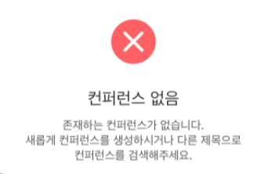

[toc]

# FE 요구사항 명세서

# Sub 1

## 홈페이지

### 기본적으로 전체 채팅방이 조회되는 상태로 구현

### 네비게이션(비로그인상태)

- 홈 버튼
- 로그인 버튼
- 회원가입 버튼

### 네비게이션(로그인상태)

- 홈 버튼
- 지난회의이력 버튼
- 로그아웃 버튼

### 회원가입페이지(팝업)

- 헤더
    - 타이틀: 회원가입
    - 닫기 버튼
- 컨텐츠
    - 소속(필수아님)/직책(필수아님)/이름/아이디/비밀번호/비밀번호확인
    - 가입하기 버튼
- 성공시 성공 메시지 / 실패시 실패 메시지

### 로그인페이지(팝업)

- 헤더
    - 타이틀: 로그인
    - 닫기 버튼
- 컨텐츠
    - 아이디/비밀번호
    - 로그인 버튼
- 성공시 성공 메시지 / 실패시 실패 메시지

### 페이지 이동간 대기시간에 로딩스피너 적용

---

# Sub 2

## 홈페이지

### 네비게이션(로그인상태)

- 미팅룸 생성하기 버튼
- 프로필 버튼
- 검색 버튼

### 미팅룸 생성 페이지(팝업)

- 헤더
    - 타이틀: 컨퍼런스 생성하기
    - 닫기 버튼
- 컨텐츠
    - 용도(드롭다운으로 리스트 표시)
        - ex)업무/교육/기타
    - 제목(텍스트 입력 필드)
    - 설명(텍스트에어리어 필드)
    - 썸네일(파일필드)
    - 생성하기 버튼
        - 모든 필드의 유효성 검사가 통과되어야 버튼 활성화
        - 유효하지 않은경우 생성하기 버튼 비활성화
- 성공시 ‘방 상세 보기’ 페이지 진입
- 실패시 실패 메시지

### 프로필 페이지(팝업)

- 헤더
    - 타이틀: 프로필
    - 닫기 버튼
- 컨텐츠
    - 소속(필수아님/텍스트 입력 필드)
    - 직책(필수아님/텍스트 입력 필드)
    - 이름(텍스트 입력 필드)
    - 아이디(텍스트 입력필드/읽기전용/비활성화)
    - 저장하기 버튼
        - 기본적으로 비활성화
        - 소속/직책/이름 필드에 키보드 입력시마다 유효성 체크
        - 유요한 경우 버튼 활성화
        - 저장 성공 시 성공 메시지 / 실패시 실패 메시지

### 정렬 버튼

- 오름차순/내림차순 모두 구현
- 시간 순 정렬 버튼
- 제목 순 정렬 버튼

### 방목록

- 기본적으로 전체 채팅방이 조회되는 상태
- 컨텐츠 영역에 아이템을 카드 형태로 표시
- 인피니트 스크롤 구현/페이지네이션 20개씩
- 정렬 버튼에서 선택한 정렬 기준 반영
- 검색 키워드가 존재할 경우 검색 키워드 반영
- 방목록 아이템
    - 썸네일(이미지)
    - 제목(최대 1줄, 넘어가면 clamp 처리)
    - 설명(최대 3줄, 넘어가면 clamp 처리)
    - 상태(진행중/종료됨)
    - 참여인원(N명 참여중)
- 방 목록이 없는 경우 아래와 같이 표시
  
    
    

## 방 상세 보기 페이지

### 네비게이션(방 상세 보기 상태)

- 검색 버튼 / 생성하기 버튼/ 프로필 버튼 숨김
- 나가기 버튼 표시
    - 클릭시 ‘종료하시겠습니까?’ 메시지
    - 확인 & 취소 버튼이 포함된 컨펌 툴팁 표시
    - 나가기 버튼 누를 시 홈페이지 뷰로 전환 및 네이게이션(로그인상태)로 전환

### 컨퍼런스 룸 정보

- 컨퍼런스 썸네일 & 제목 & 시작시간 & 설명 정보를 표시
    - 썸네일은 가로 40px, 세로 40px, 원형, 수직 가운데 정렬 표시
    - 시작시간은 텍스트를 오른쪽 정렬 및 수직 가운데 정렬
    - 컨퍼런스 설명 정보를 텍스트로 표시

### 비디오

- WebRTC 연결
- 비디오 가로 400px, 세로 225px

### 채팅창

- 대화방 영역과 메시지 전송 영역으로 구분
- 가로사이즈는 260px 고정
- 스크롤 가능
- 메시지 전송 영역
    - 플레이스홀더: 메시지 입력
    - 키보드 엔터 이벤트: 입력 필드 값 초기화
    - 메시지 전송버튼
        - 메시지 입력 필드 우측에 메시지 전송 버튼 표시