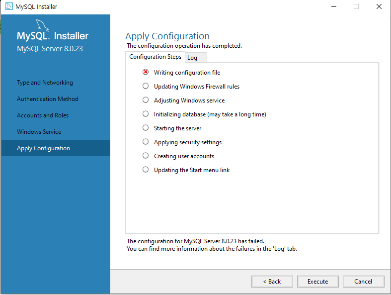
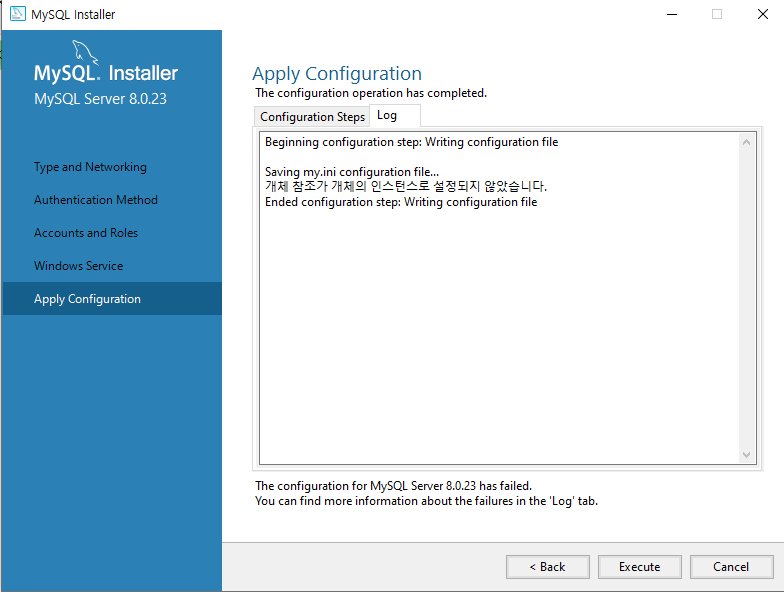
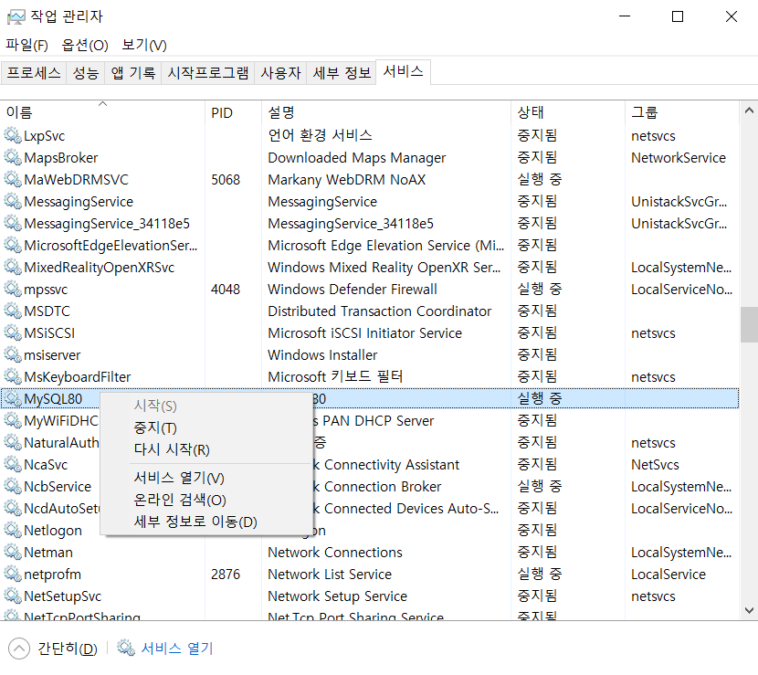
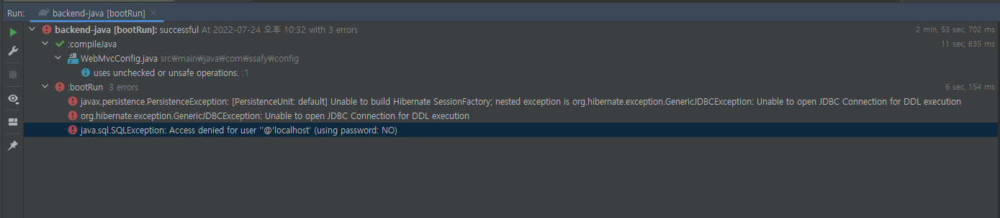
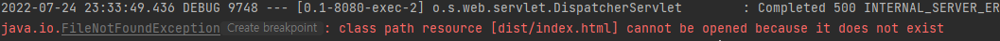
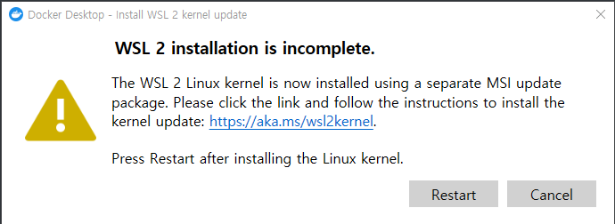

### 2주차 업무일지 _ 김동신


#### 7/18

- Jira 컨벤션 수정 및 공유
- Jira 이슈 등록을 위한 주간 업무표 작성
- Jira Sprint 및 Issue (Epic, Story) 생성


#### 7/19

- 와이어프레임 생성을 위한 Design Asset 생성


#### 7/20

- 디자인 에셋 Button의 컴포넌트화 추가 작업
- git branch가 로컬에 pull되지 않는 오류 수정
  - branch명 오타로 인한 오류
- 로그인, 회원가입 페이지 디자인 및 와이어프레임 생성 


#### 7/21

- 첫번째 게임 동상이몽 페이지 디자인 및 와이어프레임 생성


#### 7/22

- 개발환경 세팅


#### 7/25

#### < 개발환경 세팅에서 겪었던 오류 및 해결>

##### MySQL

- configuration file 

  

  

  - Searching 결과

    - mysql 관련 모든 파일을 삭제하고 재설치(Installer 관련)
    - 레지스토리 편집기에서 관련 파일 전부 삭제

  - but 아무런 변화 없이 여전히 같은 오류 발생 (버전 문제일거라 판단)

  - ##### 해결방법

    1. C 드라이브에서 MySQL 관련 모든 파일 삭제
    2. 최신 버전 MySQL 설치
    3. 해결

- 환경변수 미설정으로 인한 오류 발생

  - 환경변수 설정을 해야 cmd에서 mysql 실행 가능

- Can't connect to MySQL server on localhost

  - MySQL이 켜져있지 않은 경우 발생하는 오류

  - 서비스에서 mysql 실행

    


##### IntelliJ 

- bootrun 오류 

  

  - 생성된 db가 없어서 발생한 오류로 추정
  - MySQL에서 database 생성 후 재실행시 해결

- class path 오류

  

  - 스켈레톤 코드의 폴더명으로 인한 오류 발생
  - 대충 봤을 때, bootrun을 하면 front에서 파일을 번들링해옴
  - but, 해당 경로가 backend로 지정이 되어있어 새로운 폴더 생성 (기존 폴더는 backend-java로 되어있기 때문)


##### 통합 빌드 및 실행

- 통합 빌드 명령어

  ```bash
  gradlew clean build
  ```

- 자바 구동

  ```bash
  java -jar jar파일명.jar
  ```

- 다시 실행시 제대로 종료가 안되면 8080 : is already in use 에러 발생

  - 8080포트로 사용되고 있는지 여부 확인

  ```bash
  netstat -ano | findstr 8080
  ```

  - 위 결과로 출력된 목록의 process_id를 입력하여 강제 종료하기

  ```bash
  taskkill /F /pid process_id
  ```

  

##### 7/26

- 로그인 페이지 구현
  - modal 구현
    - bootstrap vue 활용
    - 모달 버튼과 모달 창을 별도의 컴포넌트에서 사용하기 위해 store 활용


##### 7/27

- 중간 발표용 ppt 제작


##### 7/28

- 로그인 페이지 form 구현 완료


##### 7/29

- 회원가입 페이지 html 파일 vue 파일과 연동
- 중간 발표용 ppt 대본 작성


##### 7/31

##### Web Rtc 활용을 위한 Docker 학습

- 도커 설치

  - WSL2 오류 발생

    

    - WSL 이란? 

      - Windows Subsystem for Linux
      - 리눅스를 윈도우에서도 사용할 수 있도록 하는 시스템

    - 해결법

      1. WSL 활성 명령어 입력

         ```bash
         dism.exe /online /enable-feature /featurename:Microsoft-Windows-Subsystem-Linux /all /norestart
         ```

      2. 가상 머신 플랫폼 기능 활성화 명령어 입력

         ```bash
         dism.exe /online /enable-feature /featurename:VirtualMachinePlatform /all /norestart
         ```

      3. 리눅스 커널 최신 패키지 다운로드 및 설치

         [최신 패키지 다운로드 링크](

##### 8/1

- JIRA 생성 및 4주차 계획 수립


##### 8/2

- websocket 및 openvidu 학습


##### 8/3

- openvidu 구현